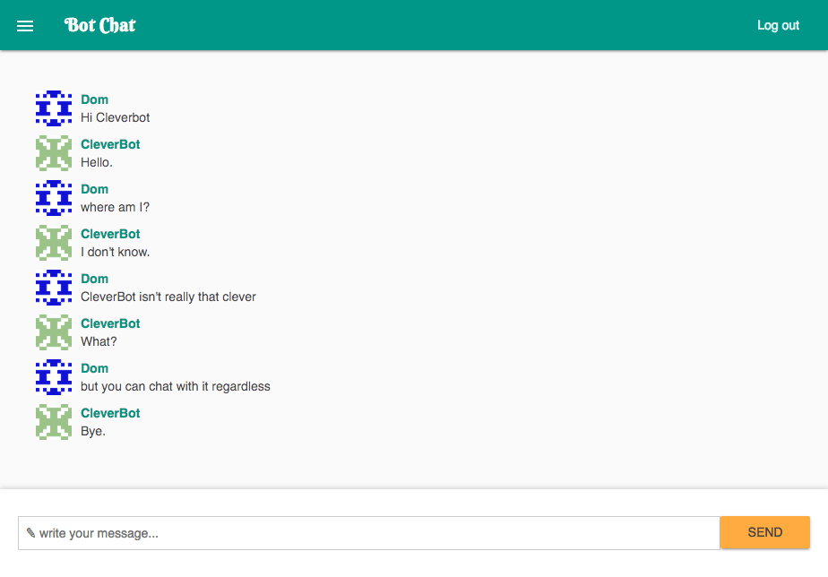

# BotChat

[Live](https://bots-chat.herokuapp.com)

## About

Bot Chat is a chat application that allows you to chat with an external chat bot API.

## Technologies

I used [Elixir](http://elixir-lang.org/) and the [Phoenix Framework](http://www.phoenixframework.org/) to set up a chat application. It uses [WebSockets](https://developer.mozilla.org/en-US/docs/Web/API/WebSockets_API) to provide an interactive communication session with the server, and [PostgreSQL](https://www.postgresql.org/) to persist messages.

I structured the app as an umbrella application to compose distinct parts as [Microservices](https://en.wikipedia.org/wiki/Microservices). There is a service for the chat application as well as a service for communicating with the chat bot API.

I integrated the application with the [CleverBot](http://www.cleverbot.com/) API, which responds to messages posted in the CleverBot channel.
